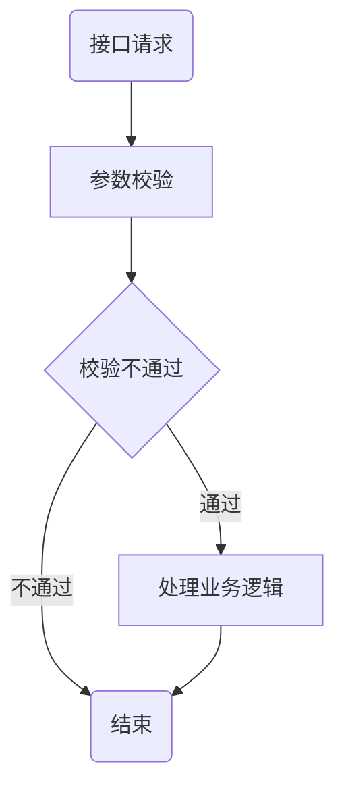
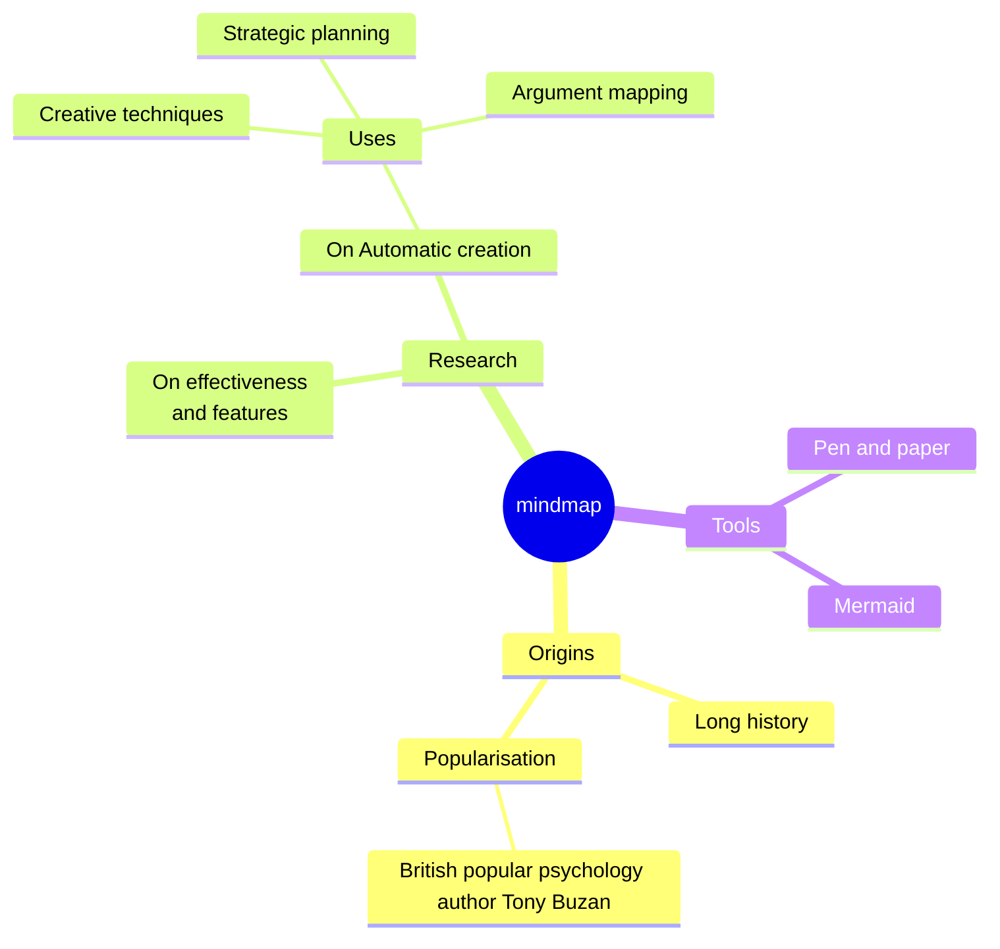

测试图

```mermaid
graph TB
    A(接口请求) --> B[参数校验]
    B[参数校验] --> C{校验通过?}
    C{校验通过?} -- 通过 --> d[处理业务逻辑]
    C{校验不通过} -- 不通过 --> e[结束]
    d[处理业务逻辑] --> e(结束)
```

```mermaid
mindmap
  root((mindmap))
    Origins
      Long history
      ::icon(fa fa-book)
      Popularisation
        British popular psychology author Tony Buzan
    Research
      On effectiveness<br/>and features
      On Automatic creation
        Uses
            Creative techniques
            Strategic planning
            Argument mapping
    Tools
      Pen and paper
      Mermaid

```
